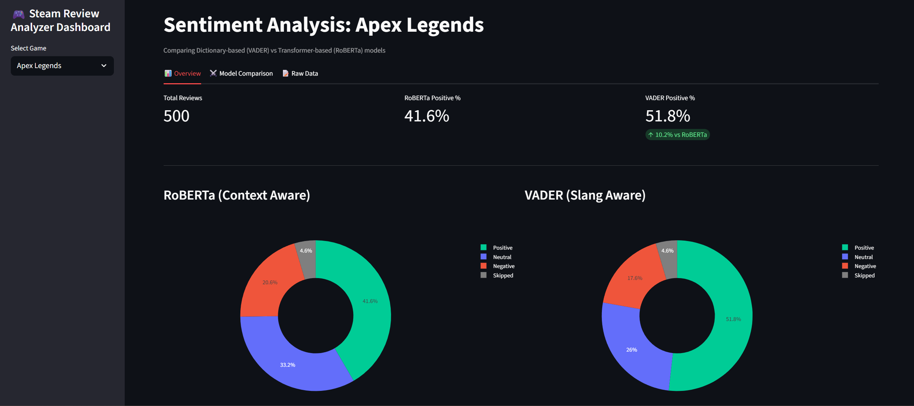

# Steam Review Sentiment Analyzer

**A Full-Stack Data Science Application exploring the gap between Gaming Slang and Contextual Sentiment.**


## Project Overview
This project is an end-to-end NLP pipeline that scrapes, analyzes, and visualizes player reviews from the Steam Store. 

Unlike standard sentiment analysis, this project implements a **Hybrid Approach**:
1.  **VADER (Lexicon-based):** Tuned with a custom dictionary to catch gaming slang (e.g., "Peak", "Mid", "Goated").
2.  **RoBERTa (Transformer-based):** A deep-learning model (`cardiffnlp/twitter-roberta-base-sentiment`) to understand complex context and sarcasm.

The result is a comparative dashboard that highlights where traditional models fail against modern transformers in the gaming domain.

### Dashboard Preview


## Architecture

**ETL Pipeline:**
* **Extract:** Custom Python script with pagination handling to scrape 500+ reviews per game via **Steam Web API**.
* **Transform:** Data cleaning, language detection (`langdetect`), and numeric type casting.
* **Load:** Upsert logic implemented in **MongoDB Atlas** to prevent duplicates while allowing incremental data updates.

**Analysis:**
* **Hybrid Logic:** Reviews are processed by both models.
* **Language Filter:** Automated detection to flag and filter non-English reviews (while preserving short slang like "GG").

**Visualization:**
* **Streamlit:** Interactive dashboard.
* **Plotly:** Dynamic donut charts and scatter plots to visualize model disagreement rates.

## Features
* **Real-time Data Collection:** Fetches the latest reviews directly from Steam.
* **Comparison Mode:** Side-by-side view of how VADER and RoBERTa score the same review.
* **Disagreement Inspector:** A specific filter to find reviews where the models contradict each other (e.g., VADER says "Positive" due to keywords, RoBERTa says "Negative" due to context).
* **Visual Diagnostics:** "Skipped" data visualization to track data quality issues (Non-English/Empty).

## Installation & Setup

**1. Clone the Repository**
```bash
git clone https://github.com/aaryanpatil/steam-sentiment-analyzer.git
cd steam-sentiment-analyzer
```
**2. Set up Virtual Environment**
```bash
# Windows
python -m venv venv
venv\Scripts\activate

# Mac/Linux
python3 -m venv venv
source venv/bin/activate
```
**3. Install Dependencies**
```bash
pip install -r requirements.txt
```
**4. Configuration**
Create a `.env` file in the root directory and add your MongoDB connection string:
```bash
MONGO_URI = # insert your connection string here
```

## How to Run
**Step 1: Fetch Data** - Scrape recent reviews from Steam and save to MongoDB
```bash
python data_collector.py
```
**Step 2: Analyze Sentiment** Run the Hybrid NLP pipeline (VADER + RoBERTa) on new reviews.
```bash
python sentiment_analyzer.py
```
**Step 3: Launch Dashboard** Start the web application.
```bash
streamlit run app.py
```

## Scripts
`data_collector.py`: ETL script handling API pagination and Database upserts.

`sentiment_analyzer.py`: The "Brain". Loads models, detects language, and updates DB with scores.

`app.py`: The Frontend. Streamlit dashboard with Plotly logic.

`requirements.txt`: Python dependencies.

## Insights & Findings
* **The "Slang Gap":** VADER outperformed RoBERTa on short, slang-heavy reviews. Because we injected domain-specific terms (e.g., "Peak", "Mid"), VADER successfully caught sentiment that the Transformer model missed.
* **Complexity vs. Speed:** RoBERTa was significantly slower and required GPU resources, yet struggled with "Gamer Jargon" without fine-tuning.
* **Conclusion:** For niche communities with specific vocabularies, a rule-based model with a custom lexicon can be more effective and efficient than a general-purpose Large Language Model (LLM).
